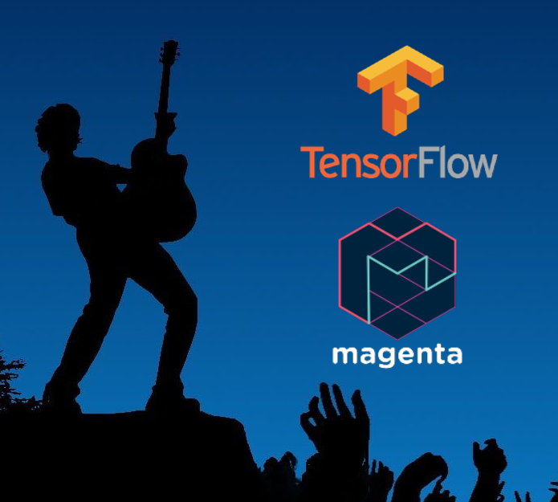

# Music with AI - Create a melody or join a band!

## Demo

Check out the demo!

[Live Demo](music.stevenjrusso.com)

## Overview

Music and technology are huge passions of mine. Over the years I have struggled to figure out how to really use Midi controllers to make create loops to play over.  I always end up spending more time learning an interface like Logic Pro or Fruity Loops than actually playing music.  

Enter the amazing power of **TensorFlow.js** and **Magenta**.  These two libraries are super powerful, and allow users to create amazing work.  **Tensorflow** is a machine learning library supported by Google, and Magenta a specificaly trained ML model focused on music, art, and a bunch more.  

By leverage the models created by the TensorFlow team, this simple model learns to emulate music that was provided as an input.

For great documentation on **Magenta** and the main library used in this project, **MidiMe**, check out the site [MidiMe](https://magenta.tensorflow.org/midi-me)

## Inspiration

Credit where credit is due:

- [Style Sliders](https://codepen.io/glitchtank/pen/HluCj)
- [Website Theme](https://www.guitarhero.com/game)
- [MidiMe Coding](https://magenta.tensorflow.org/midi-me)